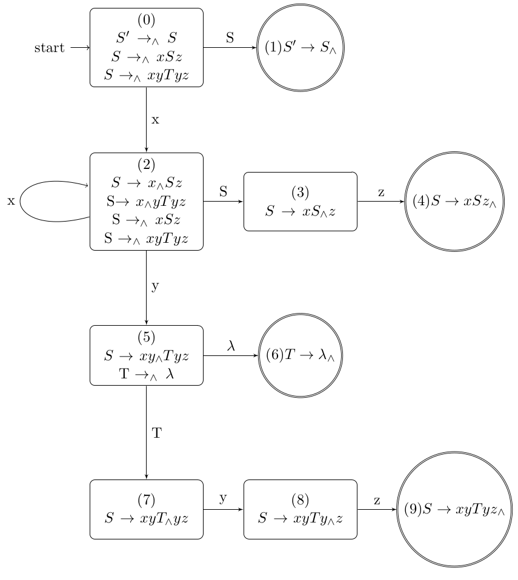

Autómatas y Lenguajes Formales Proyecto

Raúl Daniel García Ramón rauld.garcia95@gmail.com zs22000520@estudiantes.uv.mx

22 de diciembre de 2022

**Índice**

1. [**Lenguaje.](#_page1_x125.80_y129.78) **2**
1. [**Autómata](#_page4_x125.80_y129.78) **5**
1. [**Parse Table](#_page5_x125.80_y129.78) **6**
1. [**Código](#_page5_x125.80_y356.25) **6**
1. **Lenguaje.**

A partir del siguiente lenguaje generar su autómata, su tabla parse y programar el algoritmo LR(1) para comprobar que cadenas son aceptadas o no por el lenguaje dado.

*S* → *xSy* (1) 

*S* → *xyTyz* (2) 

*T* → *λ* (3)

Primero se introduce un nuevo símbolo de inicio *S*  :

*S*   → *S* (4)

Después se agregan las cerraduras del set de reglas reescritas con el marca- dor:

*S* → *x*∧*Sy* (5) 

*S* →∧ *xSy* (6) 

*S* →∧ *xyTyz* (7) 

*S* → *xy*∧*Tyz* (8) 

*T* →∧ *λ* (9)

A continuación empezamos a crear el autómata, primero definiendo el esta- do inicial 0 como sigue:

*S*   →∧ *S*

*S* →∧ *xSz*

*S* →∧ *xyTyz*

Posteriormente continuamos creando los demás estados del autómata:

Estado 1

*s* = *S*

*X* = {*S*   →∧ *S*} *Y* = {*S*   → *S*∧} *Y c* = {*S*   → *S*∧}

Estado 2

*s* = *x*

*X* = {*S* →∧ *xSz,S* →∧ *xyTyz*}

*Y* = {*S* → *x*∧*Sz,S* → *x*∧*yTyz*}

*Y c* = {*S* → *x*∧*Sz,S* → *x*∧*yTyz,S* →∧ *xSz,S* →∧ *xyTyz*}

*s* = *x*

*X* = {*S* →∧ *xSz,S* →∧ *xyTyz*}

*Y* = {*S* → *x*∧*Sz,S* → *x*∧*yTyz*}

*Y c* = {*S* → *x*∧*Sz,S* → *x*∧*yTyz,S* →∧ *xSz,S* →∧ *xyTyz*} 

El estado 2, con transición *x* lleva a si mismo.

Estado 3

*s* = *S*

*X* = {*S* → *x*∧*Sz*} 

*Y* = {*S* → *xS*∧*z*} 

*Y c* = {*S* → *xS*∧*z*}

Estado 4

*s* = *z*

*X* = {*S* → *xS*∧*z*} 

*Y* = {*S* → *xSz*∧} 

*Y c* = {*S* → *xSz*∧}

Estado 5

*s* = *y*

*X* = {*S* → *x*∧*yTyz*}

*Y* = {*S* → *xy*∧*Tyz*}

*Y c* = {*S* → *xy*∧*Tyz,T* →∧ *λ*}

Estado 6

*s* = *λ*

*X* = {*T* →∧ *λ*} 

*Y* = {*T* → *λ*∧} 

*Y c* = {*T* → *λ*∧}

Estado 7

*s* = *T*

*X* = {*S* → *xy*∧*Tyz*} 

*Y* = {*S* → *xyT*∧*yz*} 

*Y c* = {*S* → *xyT*∧*yz*}

Estado 8

 *s* = *y*

*X* = {*S* → *xyT*∧*yz*} 

*Y* = {*S* → *xyTy*∧*z*} 

*Y c* = {*S* → *xyTy*∧*z*}

Estado 9

*s* = *z*

*X* = {*S* → *xyTy*∧*z*} 

*Y* = {*S* → *xyTyz*∧} 

*Y c* = {*S* → *xyTyz*∧}

2. **Autómata**

El autómata generado por el lenguaje es el siguiente: start *S*  →→(0)∧ ∧*xSz* (1)*S* → *S*∧

*S S* S  

*S* →∧ *xyTyz*

x

(2) 

*S* → *x*∧*Sz* 

S→ *x*∧*yTyz* S (3) z 

x S →∧ *xSz S* → *xS*∧*z* (4)*S* → *xSz*∧

S →∧ *xyTyz*

y

(5) 

*S* → *xy*∧*Tyz λ* (6)*T* → *λ*∧ 

T →∧ *λ* 

T 

(7) y (8) z 

*S* → *xyT*∧*yz S* → *xyTy*∧*z* (9)*S* → *xyTyz*∧

6

3. **Parse Table**

La tabla parse que se genera a partir del autómata anterior es la siguiente:

|**Token**|**x**|**y**|**z**|**EOS**|**S**|**T**|
| - | - | - | - | - | - | - |
|0|shift 2||||shift 1||
|1||||ACCEPT|||
|2|shift 2|shift 5|||shift 3||
|3|||shift 4||||
|4|||*S* → *xSz*|*S* → *xSz*|||
|5||*T* → *λ*||||shift 7|
|6||*T* → *λ*|||||
|7||shift 8|||||
|8|||shift 9||||
|9||||*S* → *xyTyz*|||
4. **Código**

El algoritmo se programo en el lenguaje python, se utilizo la librería pandas para el manejo de la tabla parse y numpy para manejar el stack y la cadena de entrada.

A continuación se muestran unas pruebas realizadas con diferentes cadenas para ver el comportamiento general del programa:

1  Ingrese la cadena deseada:xxyyzz

2  Cadena Aceptada.

3  

4  Ingrese la cadena deseada:xxxyyzzz

5  Cadena Aceptada.

6

7  Ingrese la cadena deseada:xyz

8  Cadena no aceptada.

9

10  Ingrese la cadena deseada:xyyz

11  Cadena Aceptada.

12

13  Ingrese la cadena deseada:xxyz

14  Cadena no aceptada.

15

16  Ingrese la cadena deseada:xxyyzzz

17  Cadena no aceptada.

18

19  Ingrese la cadena deseada:xxxyyzz

20  Cadena no aceptada.

Como se logra ver se aceptan únicamente las cadenas que si pueden ser ge- neradas por el lenguaje, mientras que en el momento en que se detecta que una cadena no puede ser generada por el lenguaje, se imprime que la cadena no es aceptada y se detiene el computo sin necesidad de revisar el resto de la cadena puesto que ya se sabe que no es aceptada.

**Referencias**

Brookshear, J. G. (1989). *Theory of Computation, Formal Languages, Au-*

*tomata, and Complexity*. The Benjamin/Cummings Publishing Company, Inc.

Sipser, M. (2006). *Introduction to the Theory of Computation*. Thomson

Course Technology, 2nd edition.

